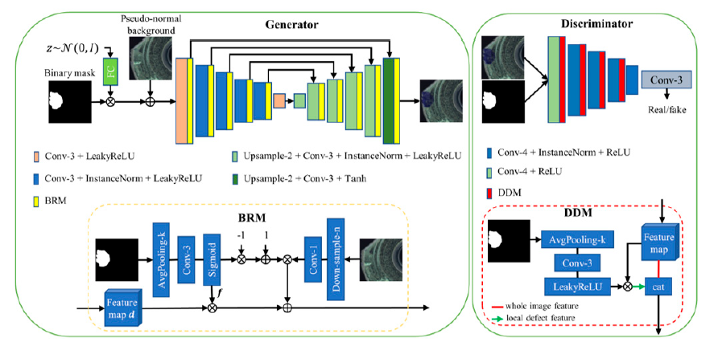
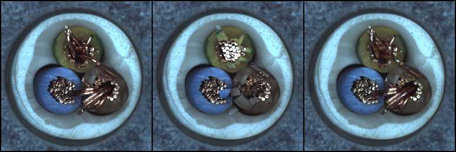
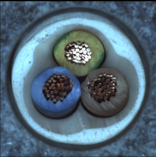
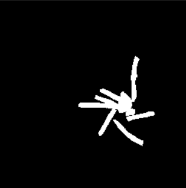
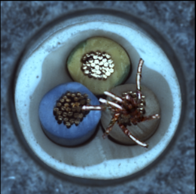

# MDGAN Pytorch implementation
- Mask guided Generation Method for Industrial Defect Images with Non-uniform Structures 
- https://www.mdpi.com/2075-1702/10/12/1239

## Model summary
### 1) Architecture

### 2) Train result
<figure>
    
    <figcaption> input defect image -> Pseudo-Normal backgroud -> generated image</figcaption>
</figure>

### 3) Test result

<figure>
    <figcaption> input noraml image + input mask image -> generated image </figcaption>
</figure>

## Installation
    $ git clone https://github.com/hits-gold/MDGAN-pytorch.git
    $ cd pytorch-MDGAN/
    $ pip3 install -r requirements.txt

## Data prepration
    📦root
     |
     📂data	
     └─📂<dataset_name>                     # dataset 이름 ex) MVTec
        └─ 📂<image_source>                 # image source ex) cable
            ├─ 📂ground_truth           
            |   └─ 📂<defect_type>          # defect type ex) bent_wire
            |       ├─ 📜001.png            # binary mask image
            |       └─ 📜002.png            # give one of these path for arguments <mask_path>
            └─ 📂images
                ├─ 📂<defect_type>          # defect type ex) bent_wire
                |   ├─ 📜001.png            # defect image
                |   └─ 📜002.png
                |    
                └─ 📂good                   # Test
                    ├─ 📜normal_image1.png  # normal image
                    └─ 📜normal_image2.png  # give one of these path for arguments <normal_path>

## Run
1. train

        python main.py --istrain train --exp <experiment name> --root ./data/<datasetname>/<image source> --defect_type <defect type> --normal_path <normal_path> --epochs <num epochs> --batch_size <batch_size>
    
    - <normal_path> -> normal image to create Pseudo-Normal backround during Training

2. test

        python main.py --istrain test --exp <experiment name> --root ./data/<datasetname>/<image source> --defect_type <defect type> --mask_path <mask_path> --epochs <saved model num epochs>

    - <mask_path> -> mask image to create defect on normal image during Testing

## Result
    📦root
     ├─📂result
     |  └─ 📂<exp1>            # --exp <experiment name>
     |      ├─ 📂img           # save generated image during Training
     |      ├─ 📂model         # save model during Training
     |      ├─ 📂inference     # save generated image during Test
     |      └─ 📜log.txt       # logs
     |
     └─📂logs                  # tensorboard log
        └─ 📂<exp1>
            └─ 📜tensorboard_tfevent
